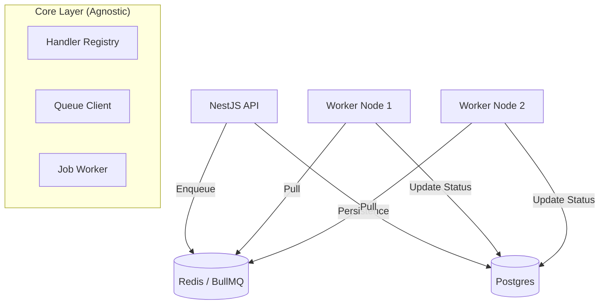

# 🚀 Distributed Job Processing Platform

A production-grade, reusable, and scalable job processing system built with **NestJS**, **BullMQ**, **Redis**, and **Postgres**.

## 🏗 Architecture

The system is designed with a strict separation of concerns to ensure framework independence and high scalability.



### Key Layers:
- **`job-core`**: Framework-agnostic domain logic. Contains the Registry, Abstract Job Models, and Worker logic.
- **`job-nest`**: NestJS adapter. Provides Dependency Injection and Module wrappers.
- **`infrastructure`**: Implementation details (Prisma repositories, specific loggers).
- **`worker-service`**: Standalone process for background execution.

---

## 🛠 Features

- ✅ **Idempotency**: Duplicate job protection via `idempotencyKey`.
- ✅ **Fault Tolerance**: Automatic retries with **Exponential Backoff**.
- ✅ **Reliability**: Dead Letter Queue (DLQ) support via `DEAD` status.
- ✅ **Observability**: Real-time stats endpoint and structured logging.
- ✅ **Scalability**: Horizontal scaling support (Docker ready).
- ✅ **Resilience**: Timeout handling and stalled job detection.

---

## 🚀 Getting Started

### 1. Prerequisites
- Docker & Docker Compose
- Node.js 20+

### 2. Setup Infrastructure
```bash
docker compose up -d postgres redis
```

### 3. Initialize Database
```bash
npx prisma db push
```

### 4. Run the Platform
```bash
# Start the API
npm run start:dev

# Start the Worker
npx ts-node src/worker/main.ts
```

---

## 📖 API Guide

### Create an Email Job
`POST /jobs`
```json
{
  "type": "email",
  "payload": {
    "to": "user@example.com",
    "subject": "Welcome!",
    "body": "Thanks for joining our platform."
  },
  "idempotencyKey": "unique-id-123"
}
```

### Check System Stats
`GET /jobs/stats`
Returns counts for `QUEUED`, `PROCESSING`, `COMPLETED`, `FAILED`, and `DEAD`.

### Manual Retry
`POST /jobs/:id/retry`
Re-queues a failed or dead job.

---

## 📈 Scalability

To scale the processing power, simply increase the number of worker containers:
```bash
docker compose up --scale worker=5 -d
```

You can also adjust `CONCURRENCY` in `src/worker/main.ts` (or via env) to handle more jobs per worker instance.

---

## 🧠 Design Principles
- **Open-Closed Principle**: Add new job types by creating handlers, without touching the core engine.
- **Dependency Inversion**: High-level modules don't depend on low-level drivers (BullMQ/Prisma). They depend on interfaces.
- **Statelessness**: No local state in the API or Worker, allowing for infinite horizontal scaling.
